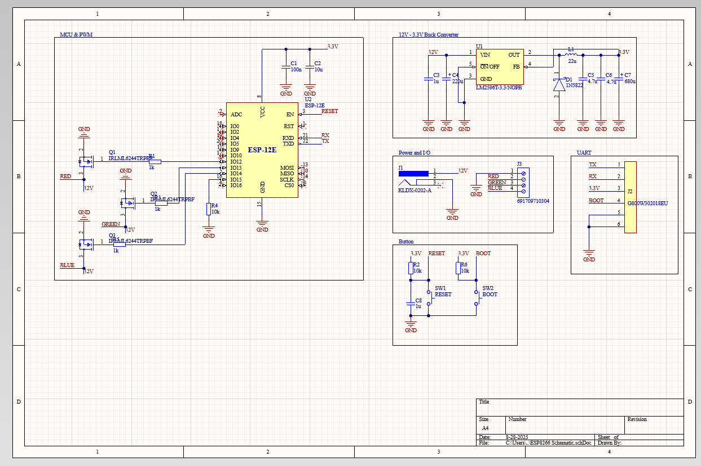
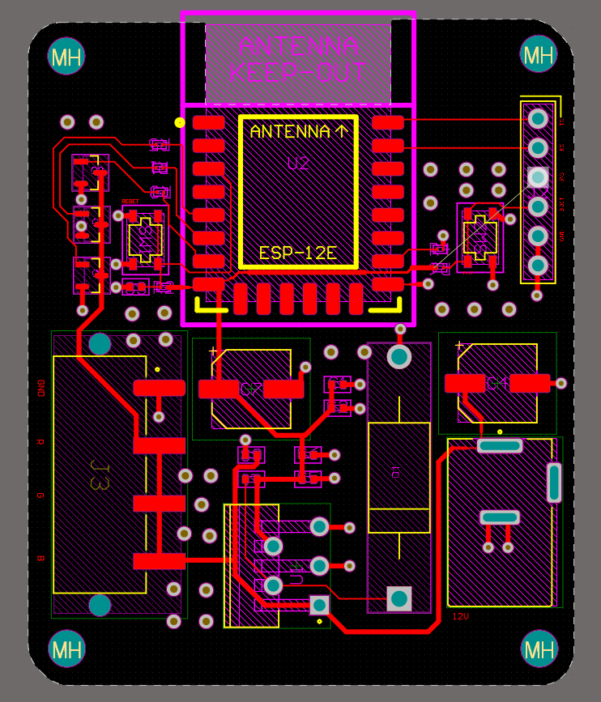
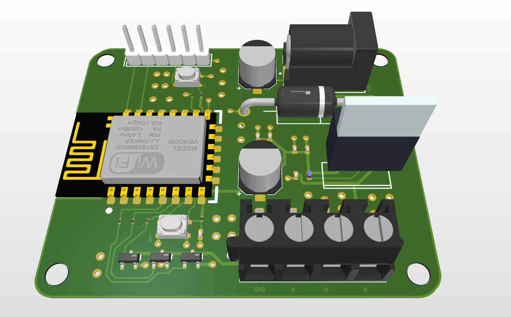

# ESP8266 Led Strip Controller

A custom PCB design for an LED strip controller made in Altium Designer. The board is built around the ESP8266-12E module and includes N-channel MOSFET drivers for controlling RGB LEDs. It features a 12V to 3.3V buck converter for power regulation, a Barrel Jack power input, and support for UART. 

## Schematic 

- Includes ESP8266-12E module, UART support, user I/O, 12V-3.3V Buck Converter

## 2D View PCB

## 3D View PCB

## Skills Gained

- PCB design basics such as routing, grounding, polygon pour
- Switching regulators and MOSFETs
